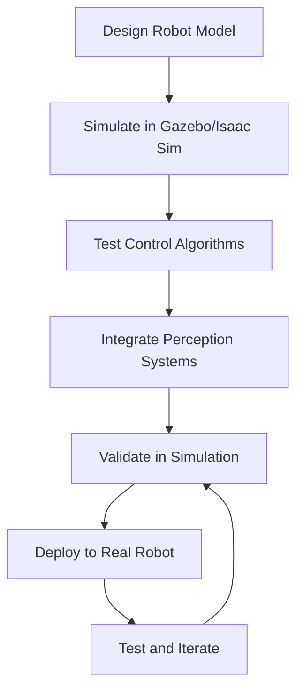

# Development Workflow

## Overview

This document outlines the recommended development workflow for humanoid robotics projects using the tools and frameworks covered in this book. A structured development workflow is essential for managing the complexity of humanoid robot systems and ensuring reliable, maintainable code.

## The Robotics Development Lifecycle

### 1. Specification and Planning
Before starting any robotics project, it's important to clearly define requirements and plan the implementation:

- **Requirements Analysis**: Define what the robot should do and the constraints it must satisfy
- **System Architecture**: Plan how different components will interact
- **Development Timeline**: Establish milestones and checkpoints
- **Risk Assessment**: Identify potential challenges and mitigation strategies

### 2. Simulation-First Development
The recommended approach for humanoid robotics development is to start with simulation:



### 3. Iterative Development Process
Robotics development is inherently iterative due to the complexity of real-world interactions:

- **Plan**: Define specific features or improvements
- **Implement**: Develop and test in simulation
- **Test**: Validate behavior in simulation and real-world
- **Refine**: Adjust based on test results
- **Document**: Record changes and lessons learned

## Recommended Development Tools

### Version Control with Git
```bash
# Initialize repository
git init
git add .
git commit -m "Initial humanoid robot setup"

# Create feature branches
git checkout -b feature/humanoid-navigation
# Make changes...
git add .
git commit -m "Implement basic navigation for humanoid"
git push origin feature/humanoid-navigation

# Merge via pull request
git checkout main
git merge feature/humanoid-navigation
```

### Workspace Organization
```
humanoid_robot_project/
├── src/
│   ├── robot_control/          # Control algorithms
│   ├── robot_perception/       # Perception systems
│   ├── robot_navigation/       # Navigation algorithms
│   └── robot_simulation/       # Simulation interfaces
├── models/                     # Robot models (URDF, meshes)
├── worlds/                     # Simulation environments
├── launch/                     # Launch files
├── config/                     # Configuration files
├── scripts/                    # Utility scripts
└── tests/                      # Unit and integration tests
```

### ROS 2 Workspace Setup
```bash
# Create workspace
mkdir -p ~/humanoid_ws/src
cd ~/humanoid_ws

# Build workspace
colcon build --packages-select humanoid_control humanoid_perception

# Source the workspace
source install/setup.bash
```

## Simulation Development Workflow

### 1. Model Development
Start by creating or refining the robot model:

```bash
# Create URDF model
cd ~/humanoid_ws/src/robot_description
# Edit URDF files to define robot structure

# Test model in RViz
ros2 run robot_state_publisher robot_state_publisher --ros-args -p robot_description:=$(cat robot.urdf)
```

### 2. Simulation Testing
Test robot behavior in simulation before real-world deployment:

```bash
# Launch simulation environment
ros2 launch robot_simulation simulation.launch.py

# Test control algorithms
ros2 run robot_control joint_position_controller

# Monitor robot state
ros2 topic echo /joint_states
```

### 3. Control Algorithm Development
Develop and refine control algorithms iteratively:

```python
# Example: Humanoid balance controller
class BalanceController:
    def __init__(self):
        self.zmp_publisher = self.create_publisher(Float64MultiArray, 'zmp_target', 10)
        self.com_subscriber = self.create_subscription(Point, 'com_position', self.com_callback, 10)

    def balance_control_step(self):
        # Calculate balance correction based on CoM and ZMP
        error = self.desired_zmp - self.current_zmp
        control_output = self.balance_pid.update(error)
        self.publish_balance_correction(control_output)
```

## Testing and Validation

### Unit Testing
Test individual components in isolation:

```python
import unittest
from robot_control.balance_controller import BalanceController

class TestBalanceController(unittest.TestCase):
    def setUp(self):
        self.controller = BalanceController()

    def test_stability_check(self):
        # Test that controller maintains stability
        com_pos = [0.0, 0.0, 0.8]  # Stable CoM position
        result = self.controller.check_stability(com_pos)
        self.assertTrue(result)

    def test_zmp_calculation(self):
        # Test ZMP calculation
        com_pos = [0.1, 0.05, 0.8]
        zmp = self.controller.calculate_zmp(com_pos)
        self.assertIsNotNone(zmp)
```

### Integration Testing
Test how components work together:

```bash
# Launch complete system in simulation
ros2 launch robot_system full_system.launch.py

# Run integration tests
ros2 run robot_test_suite integration_tests
```

### Performance Testing
Validate system performance under various conditions:

```python
def test_navigation_performance():
    """Test navigation performance metrics"""
    # Record navigation time, success rate, and accuracy
    start_time = time.time()
    success = navigate_to_goal()
    end_time = time.time()

    assert success, "Navigation should succeed"
    assert (end_time - start_time) < MAX_NAVIGATION_TIME, "Navigation should be timely"
```

## Debugging Strategies

### 1. Simulation Debugging
Use simulation tools to visualize and debug robot behavior:

```bash
# Visualize robot in RViz
ros2 run rviz2 rviz2 -d config/navigation.rviz

# Monitor topics
ros2 topic echo /robot_state
ros2 topic echo /control_commands

# Use rqt for GUI-based monitoring
ros2 run rqt rqt
```

### 2. Logging and Monitoring
Implement comprehensive logging for debugging:

```python
import rclpy
from rclpy.node import Node

class DebugNode(Node):
    def __init__(self):
        super().__init__('debug_node')

    def log_robot_state(self, state):
        self.get_logger().info(f'Robot state: {state}')
        self.get_logger().debug(f'Joint positions: {state.joint_positions}')
        self.get_logger().warn(f'Low battery: {state.battery_level < 0.2}')
```

### 3. Data Recording and Analysis
Record robot data for offline analysis:

```python
import pandas as pd
import matplotlib.pyplot as plt

def analyze_robot_performance(log_file):
    """Analyze robot performance from log data"""
    data = pd.read_csv(log_file)

    # Plot performance metrics
    plt.figure(figsize=(12, 8))
    plt.subplot(2, 2, 1)
    plt.plot(data['time'], data['battery_level'])
    plt.title('Battery Level Over Time')

    plt.subplot(2, 2, 2)
    plt.plot(data['time'], data['navigation_success'])
    plt.title('Navigation Success Rate')

    plt.tight_layout()
    plt.show()
```

## Deployment Workflow

### 1. Simulation to Real Robot
When transitioning from simulation to real robot:

1. **Safety Check**: Verify all safety systems are functional
2. **Calibration**: Calibrate sensors and actuators
3. **Gradual Deployment**: Start with simple behaviors and increase complexity
4. **Monitoring**: Closely monitor robot behavior during initial deployment

### 2. Continuous Integration
Implement CI/CD for robotics projects:

```yaml
# .github/workflows/robotics_ci.yml
name: Robotics CI
on: [push, pull_request]

jobs:
  build:
    runs-on: ubuntu-latest
    steps:
    - uses: actions/checkout@v2
    - name: Setup ROS 2
      uses: ros-tooling/setup-ros@v0.7
    - name: Build packages
      run: colcon build
    - name: Run tests
      run: colcon test && colcon test-result --all
```

## Best Practices

### 1. Code Quality
- Follow ROS 2 coding standards
- Use meaningful variable and function names
- Document code thoroughly
- Implement proper error handling

### 2. Safety First
- Implement safety constraints and limits
- Use watchdog timers for critical systems
- Design graceful failure modes
- Test safety systems thoroughly

### 3. Modularity
- Create independent, reusable components
- Use ROS 2 packages to organize functionality
- Design clear interfaces between components
- Enable easy testing and replacement of components

### 4. Documentation
- Document system architecture
- Provide usage examples
- Maintain API documentation
- Record design decisions and trade-offs

## Common Pitfalls to Avoid

1. **Skipping Simulation**: Always test in simulation before real robot deployment
2. **Insufficient Testing**: Test thoroughly under various conditions
3. **Poor Error Handling**: Handle errors gracefully to prevent system failures
4. **Inadequate Logging**: Implement sufficient logging for debugging
5. **Hardcoded Values**: Use parameters for configurable values
6. **Neglecting Safety**: Always prioritize safety in robot behavior

## Conclusion

A structured development workflow is essential for successful humanoid robotics projects. By following simulation-first development, implementing comprehensive testing, and maintaining good software engineering practices, you can build robust, reliable humanoid robot systems. Remember to prioritize safety, maintain modularity, and continuously validate your system throughout the development process.