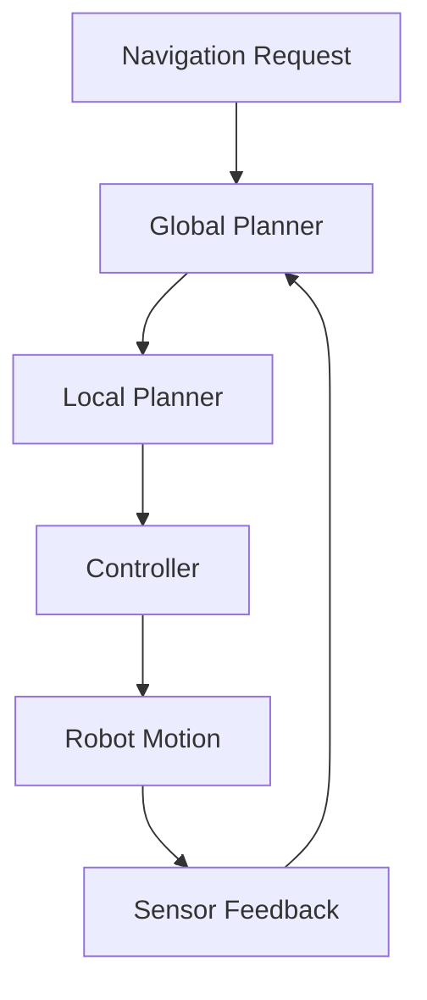
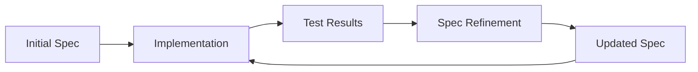

# Spec-Driven Development

## Overview

Spec-Driven Development (SDD) is a methodology that emphasizes creating detailed specifications before implementation. In the context of humanoid robotics, SDD ensures that complex systems are built with clear requirements, defined interfaces, and measurable success criteria. This approach is particularly valuable for robotics projects due to their inherent complexity and interdisciplinary nature.

## The SDD Philosophy

### Core Principles

1. **Specification First**: Define what the system should do before implementing how it does it
2. **Clear Requirements**: Document functional and non-functional requirements explicitly
3. **Measurable Criteria**: Establish quantitative success metrics
4. **Iterative Refinement**: Continuously update specifications based on learning
5. **Stakeholder Alignment**: Ensure all team members understand the requirements

### Benefits in Robotics

- **Complexity Management**: Breaks down complex robot systems into manageable components
- **Integration Clarity**: Defines clear interfaces between subsystems
- **Testing Framework**: Provides basis for comprehensive test suites
- **Risk Mitigation**: Identifies potential issues before implementation
- **Progress Measurement**: Enables objective assessment of development progress

## The SDD Process

### 1. Requirements Specification

Begin by clearly defining what the robot system needs to accomplish:

```yaml
# Example: Humanoid Navigation System Specification
system: "Humanoid Navigation System"
version: "1.0"
requirements:
  - id: "NAV-001"
    description: "Robot must navigate to specified goal location"
    category: "functional"
    priority: "high"
    acceptance_criteria:
      - "Success rate > 95% in static environments"
      - "Path efficiency within 10% of optimal"
      - "Max navigation time < 5 minutes"
  - id: "NAV-002"
    description: "Robot must avoid dynamic obstacles"
    category: "functional"
    priority: "high"
    acceptance_criteria:
      - "Avoidance success rate > 98%"
      - "Collision rate < 0.1%"
      - "Recovery time < 10 seconds"
```

### 2. Architecture Specification

Define the system architecture and component interactions:



### 3. Interface Specification

Document how components interact:

```
# Example: Navigation Service Interface
Service: NavigateToPose
Request:
  - target_pose: geometry_msgs/PoseStamped
  - tolerance: float64
Response:
  - success: bool
  - path_executed: nav_msgs/Path
  - execution_time: float64
```

## SDD in Robotics Context

### 1. Multi-Domain Integration

Humanoid robotics spans multiple domains requiring careful specification:

- **Mechanical**: Joint limits, payload capacity, physical constraints
- **Electrical**: Power consumption, sensor specifications, actuator capabilities
- **Software**: Real-time performance, safety constraints, communication protocols
- **AI/ML**: Accuracy requirements, training data specifications, model performance

### 2. Safety Specifications

Safety is paramount in humanoid robotics and must be specified explicitly:

```yaml
safety_requirements:
  - id: "SAFETY-001"
    description: "Emergency stop must halt all robot motion within 100ms"
    category: "safety"
    test_method: "Inject emergency stop signal, measure response time"
    pass_criteria: "Motion stops within 100ms"
  - id: "SAFETY-002"
    description: "Robot must maintain balance during navigation"
    category: "safety"
    test_method: "Run navigation in various scenarios, monitor balance metrics"
    pass_criteria: "ZMP remains within support polygon > 99% of time"
```

### 3. Performance Specifications

Define quantitative performance requirements:

```yaml
performance_requirements:
  - id: "PERF-001"
    description: "Perception system must process images at 30 FPS"
    category: "performance"
    test_method: "Run perception pipeline with standard dataset"
    pass_criteria: "Sustained 30 FPS on target hardware"
  - id: "PERF-002"
    description: "Navigation system must plan paths in < 1 second"
    category: "performance"
    test_method: "Run path planning with various map sizes"
    pass_criteria: "Planning completes within 1 second"
```

## SDD Tools and Artifacts

### 1. Specification Document Structure

A comprehensive robotics specification should include:

```markdown
# Robot System Specification

## 1. System Overview
- Purpose and scope
- System boundaries
- Stakeholder requirements

## 2. Functional Requirements
- Behavior specifications
- Use cases and scenarios
- Feature descriptions

## 3. Non-Functional Requirements
- Performance requirements
- Safety requirements
- Security requirements
- Quality attributes

## 4. System Architecture
- Component diagrams
- Data flow diagrams
- Interface specifications

## 5. Acceptance Criteria
- Test scenarios
- Success metrics
- Validation methods

## 6. Constraints and Assumptions
- Environmental constraints
- Resource limitations
- Technology constraints
```

### 2. Design Documentation

Create detailed design documents that implement the specifications:

```python
"""
Humanoid Navigation System Design

Based on specification: NAV-SPEC-001
Author: System Designer
Date: 2024-01-15

Implementation of navigation system meeting requirements:
- NAV-001: Goal navigation with 95% success rate
- NAV-002: Dynamic obstacle avoidance
- SAFETY-001: Emergency stop capability
"""

class HumanoidNavigator:
    """
    Implements navigation system for humanoid robot
    Meets requirements NAV-001, NAV-002, and SAFETY-001
    """
    def __init__(self):
        # Implementation details that satisfy specifications
        pass
```

### 3. Test Specification

Define tests that validate specification compliance:

```python
import unittest
from robot_navigation.navigator import HumanoidNavigator

class TestNavigationSpecCompliance(unittest.TestCase):
    """Tests to validate compliance with navigation specification"""

    def setUp(self):
        self.navigator = HumanoidNavigator()

    def test_navigation_success_rate(self):
        """Test NAV-001: Navigation success rate > 95%"""
        successes = 0
        total_attempts = 100

        for i in range(total_attempts):
            if self.navigator.navigate_to_goal():
                successes += 1

        success_rate = successes / total_attempts
        self.assertGreaterEqual(success_rate, 0.95,
                               "Navigation success rate must be > 95%")

    def test_dynamic_obstacle_avoidance(self):
        """Test NAV-002: Dynamic obstacle avoidance"""
        # Implementation of dynamic obstacle test
        avoidance_success = self.navigator.avoid_dynamic_obstacle()
        self.assertTrue(avoidance_success,
                       "Robot must successfully avoid dynamic obstacles")
```

## SDD Implementation in Robotics Projects

### 1. Iterative Specification Development

Specifications evolve as the project progresses:



### 2. Cross-Domain Coordination

Coordinate specifications across different robot subsystems:

```yaml
# Example: Cross-domain specification coordination
subsystems:
  - name: "Navigation"
    dependencies:
      - "Perception: obstacle detection"
      - "Control: motion execution"
      - "Safety: emergency stop"
  - name: "Manipulation"
    dependencies:
      - "Perception: object recognition"
      - "Control: arm positioning"
      - "Navigation: reach constraints"
```

### 3. Validation and Verification

Establish processes to validate that implementations meet specifications:

```python
def validate_specification_implementation():
    """Validate that implementation meets all specifications"""
    validation_results = {
        'functional_requirements': check_functional_requirements(),
        'performance_requirements': check_performance_requirements(),
        'safety_requirements': check_safety_requirements(),
        'interface_compliance': check_interface_compliance()
    }

    all_passed = all(validation_results.values())
    return all_passed, validation_results
```

## Best Practices

### 1. Living Documentation

Keep specifications up-to-date with implementation changes:

- Version control specifications alongside code
- Update specifications when requirements change
- Document specification rationale and decisions
- Maintain traceability between specs and code

### 2. Stakeholder Involvement

Involve all relevant stakeholders in specification development:

- Engineers: Technical feasibility and constraints
- Product managers: User requirements and business needs
- Safety engineers: Safety and compliance requirements
- Test engineers: Testability and validation requirements

### 3. Quantitative Metrics

Use quantitative rather than qualitative requirements:

```yaml
# Good: Quantitative specification
- requirement: "Robot localization accuracy < 10cm"
- test: "Measure position error over 100 trials"
- pass: "Average error < 10cm, 95% of measurements < 15cm"

# Avoid: Qualitative specification
- requirement: "Robot should be accurate at localization"
- test: "Subjective evaluation of localization"
- pass: "Team agrees localization is acceptable"
```

### 4. Traceability

Maintain traceability between specifications, implementation, and tests:

```python
# Example: Traceability in code comments
"""
Implementation of requirement NAV-001: Goal navigation with 95% success rate
Spec: navigation_spec.md#NAV-001
Test: test_navigation.py::test_navigation_success_rate
"""
def navigate_to_goal(self, target_pose):
    # Implementation that satisfies NAV-001
    pass
```

## Challenges and Solutions

### 1. Managing Complexity

**Challenge**: Robotics systems are inherently complex with many interdependent components.

**Solution**: Break down specifications into manageable modules with clear interfaces.

### 2. Dealing with Uncertainty

**Challenge**: Robotics projects often involve research and unknowns.

**Solution**: Use iterative specification refinement and maintain flexibility in specifications.

### 3. Balancing Detail and Flexibility

**Challenge**: Too much detail constrains implementation; too little creates ambiguity.

**Solution**: Specify what the system should do, not how it should do it.

## Conclusion

Spec-Driven Development is particularly valuable for humanoid robotics projects due to their complexity and interdisciplinary nature. By creating detailed specifications before implementation, teams can better manage complexity, ensure stakeholder alignment, and build more reliable robot systems. The key is to maintain living specifications that evolve with the project while providing clear guidance for implementation and validation.